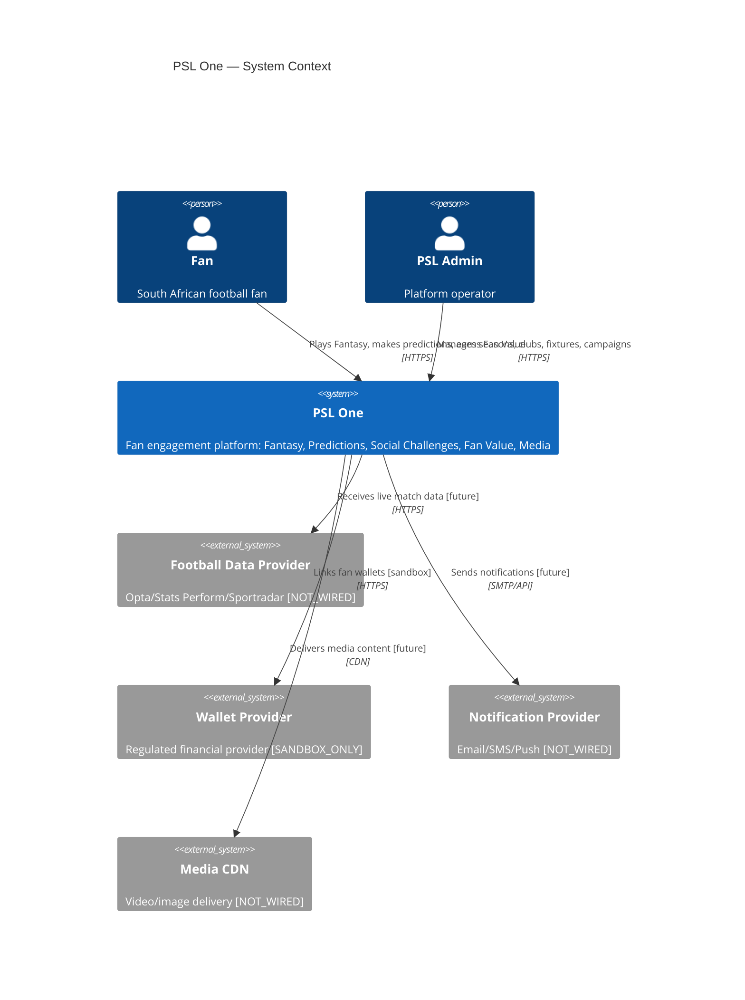
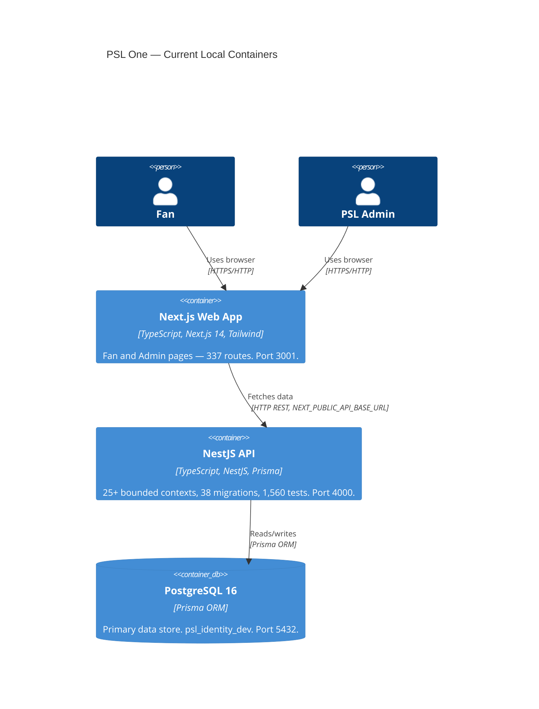
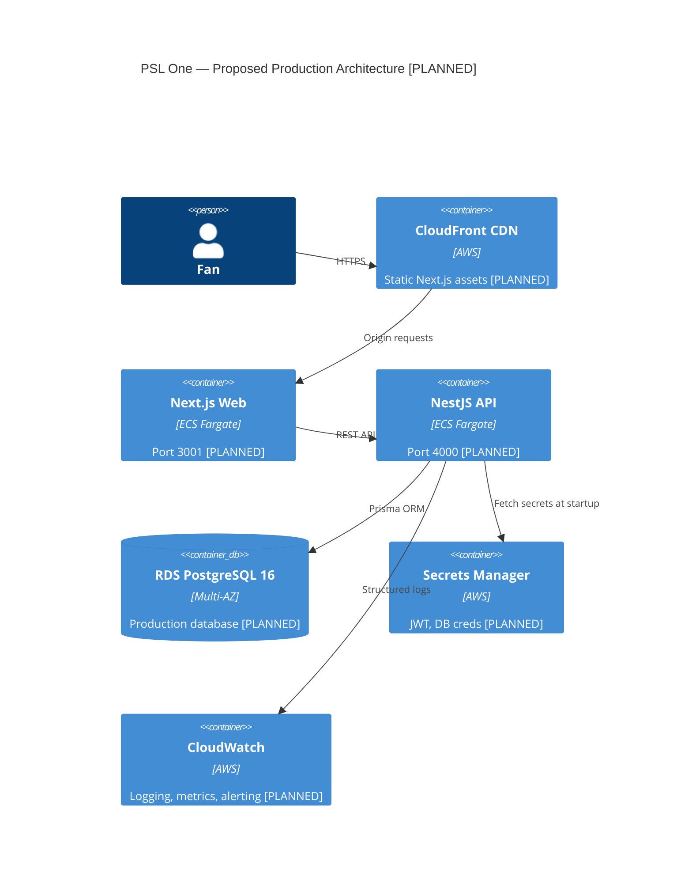

# PSL One — System Overview

**Purpose:** Platform architecture for architects and senior engineers  
**Audience:** Architects, senior engineers, DevOps  
**Status:** Current as of STORY-39  
**Last verified:** 2026-06-14  

---

## Platform Purpose

PSL One is the digital operating system of South African football. It serves fans of the Premier Soccer League with Fantasy Football, Guess the Score predictions, Social Prediction Challenges, Live Match Intelligence, Fan Value tracking, Achievements, Campaigns, Media, and a beta-ready admin control plane — all as a single integrated product.

Target scale: 2 million South African football fans.

---

## Major Actors

| Actor | Role |
|-------|------|
| Fan | Registered user who plays Fantasy, makes predictions, competes in challenges, earns Fan Value |
| PSL Administrator | Platform operator with `PSL_ADMIN` role — manages seasons, clubs, fixtures, campaigns, readiness |
| Club Operator | Future actor — club-specific content management (portal planned, not built) |
| Sponsor Operator | Future actor — campaign management via sponsor portal (planned, not built) |
| Support / Operator | PSL staff using admin pages for day-to-day operations |
| External Football Data Provider | Opta / Stats Perform / Sportradar / API-Football (not yet wired — CONTRACT_REQUIRED) |
| Wallet/Payment Provider | External regulated financial provider (not yet wired — SANDBOX_ONLY) |
| Notification Provider | Email/SMS/push provider (not yet wired — PROVIDER_REQUIRED) |
| Media Provider | CDN/DRM/streaming provider (not yet wired — RIGHTS_REQUIRED) |

---

## System Context Diagram

---

## Current Container Architecture

---

## Planned Production Architecture (Sprint 3 — NOT YET BUILT)

> All items marked [PLANNED] do not exist yet. See [Production Readiness](../operations/PRODUCTION-READINESS.md).

---

## Data Flows

### Fan Makes a Prediction

1. Fan loads `/predictions` → Web calls `GET /predictions` on API
2. API queries `Fixture` (published, locked: false) and `Prediction` (user's existing)
3. Fan submits → Web calls `POST /predictions` with score + fixture
4. API validates fixture is published, open, and within prediction window
5. API creates `Prediction` record, writes `FanValueLedger` entry for engagement
6. API optionally writes `Notification` and `ActivityFeedItem` side effects
7. Admin settles predictions → `POST /admin/predictions/:id/settle`
8. API transitions `Prediction.status: VOID/WON/LOST`, writes `PredictionPointsLedger`

### Fan Enters Fantasy

1. Fan loads `/fantasy/team` → Web calls `GET /fantasy/team`
2. API resolves active season, checks `assertFantasyOpen` (transfer window, deadline)
3. Fan makes transfers → Web calls `POST /fantasy/transfers`
4. API validates: budget, squad limits, no duplicates, window open
5. Admin scores gameweek → writes `FantasyGameweekScore`, `FanValueLedger`
6. Auto-substitution service checks bench coverage if starter scored 0

### Admin Activates Beta Cohort (No Season Activation)

1. Admin confirms 13 readiness checks at `GET /admin/beta-launch/:seasonId/readiness`
2. Admin runs dry-run at `POST /admin/beta-launch/:seasonId/dry-run` (read-only)
3. Admin creates cohort at `POST /admin/beta-launch/cohorts`
4. Admin invites fans at `POST /admin/beta-launch/cohorts/:id/members`
5. Admin creates approval record at `POST /admin/beta-launch/:seasonId/approve`
6. Approval status: `APPROVED` — season remains inactive

---

## Points and Financial Separation

PSL One has three distinct point/value systems that must never be conflated:

| System | Model | Financial? | Transferable? |
|--------|-------|-----------|---------------|
| Fantasy points | `FantasyGameweekScore` | NO | NO |
| Fan Value | `FanValueLedger` | NO | NO |
| Gameplay points (social prediction) | `SocialPredictionPointsEntry` | NO | NO (result flow only) |
| Prediction points | `PredictionPointsLedger` | NO | NO |
| Wallet balance | External provider | **External** | External |

No PSL One system moves real money. Wallet integration is sandbox-only.

---

## Season Model

Three season states coexist:

| State | `isActive` | `status` | Example |
|-------|-----------|---------|---------|
| Active | `true` | ACTIVE | FIFA World Cup 2026 |
| Prepared | `false` | UPCOMING | PSL Premiership 2026/27 |
| Historical | `false` | COMPLETED | Past seasons |

Only one season can be `isActive: true` at a time. Season switching is controlled by `SeasonSwitchingModule` with a 13-check readiness gate.

---

## Technology Stack

| Layer | Technology | Version |
|-------|------------|---------|
| API framework | NestJS | 10.x |
| API language | TypeScript | 5.4+ |
| ORM | Prisma | 5.22 |
| Database | PostgreSQL | 16 |
| Frontend framework | Next.js (App Router) | 14.x |
| Frontend language | TypeScript | 5.4+ |
| Frontend styling | Tailwind CSS | 3.x |
| Package manager | pnpm | 9.x |
| Build system | Turbo | 2.x |
| Test framework | Vitest | 4.x |
| Node | Node.js | ≥ 22.0.0 |
| Container runtime (planned) | ECS Fargate | — |
| Cloud (planned) | AWS | af-south-1 |
