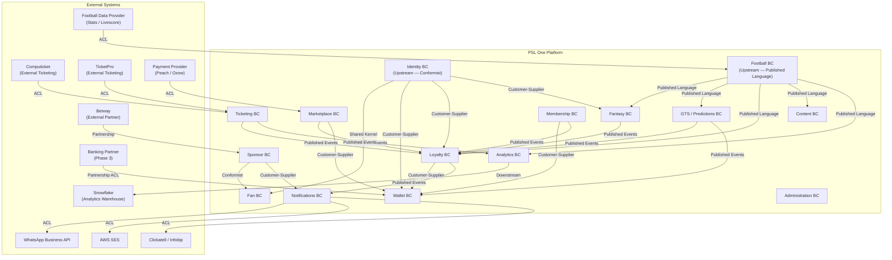
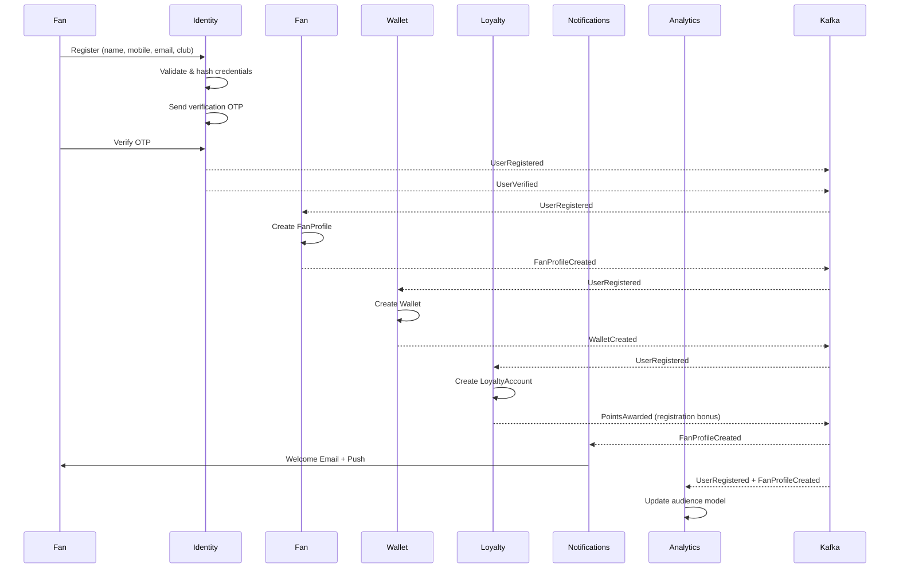
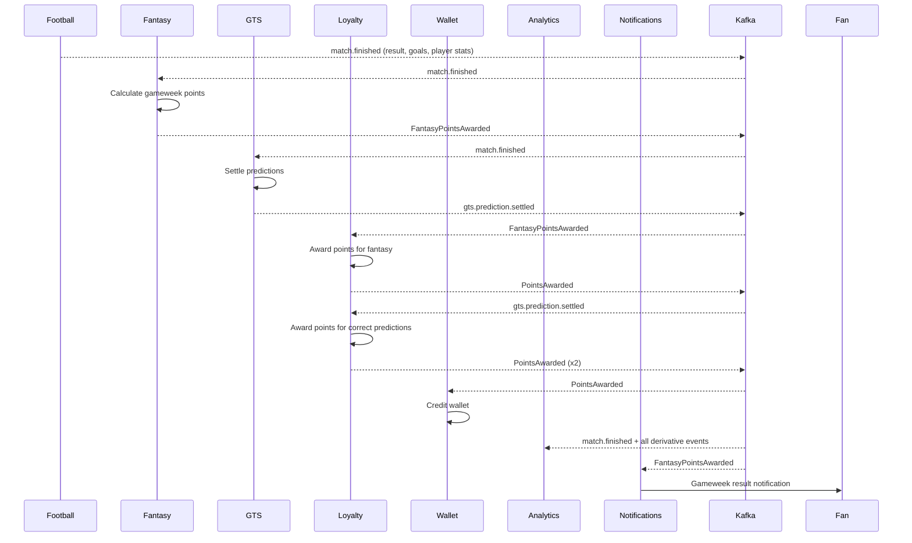

# PSL One — Context Map

**Generated:** 2026-06-08  
**Author:** PSL One Chief Architecture Agent  
**Methodology:** DDD Context Mapping (Vernon)

---

## Context Map Overview

---

## Context Relationships Detail

### Identity → All Consumer Contexts

**Relationship Type:** Customer-Supplier (Identity is Supplier)

**Integration Pattern:** Identity publishes `UserRegistered`, `UserVerified` events. All downstream contexts conform to Identity's user model.

**Shared Kernel Risk:** `UserId` and `UserRole` are shared across all contexts. Changes to these require coordinated releases.

**Published Language:** JWT containing `sub` (UserId), `roles`, `tenantId`. All services validate against this standard.

---

### Football Data Provider → Football BC

**Relationship Type:** Anti-Corruption Layer (ACL)

**Rationale:** External football data providers (e.g. Sportradar, API-Football) have their own data models. The ACL translates external data into PSL One's canonical Football domain model.

**Risk:** Single point of failure. Data provider outage stops live match data flowing to Fantasy and GTS. Requires fallback / manual override capability.

---

### Football BC → Fantasy, GTS, Loyalty, Content, Analytics

**Relationship Type:** Published Language (Football is Upstream)

**Integration Pattern:** Kafka topics with stable event contracts. Downstream contexts subscribe independently.

**Key Constraint:** Football BC defines the event schema. Downstream contexts must not modify Football events — they derive their own models.

---

### Ticketing → External Providers (Computicket, TicketPro)

**Relationship Type:** Anti-Corruption Layer

**Rationale:** Each external provider has different APIs, data models and webhook formats. The ACL normalises these into a unified `TicketPurchased` event.

**Phase 1 Risk:** PSL One is dependent on external provider uptime for ticketing. No native ticketing in Phase 1.

---

### Sponsor → Fan

**Relationship Type:** Conformist (Sponsor conforms to Fan's audience model)

**Privacy Constraint:** Sponsor context receives only aggregated audience segments from the Fan/Analytics domains. It must never access Fan PII directly. This boundary is enforced at the API and database level.

---

### GTS (Guess the Score) → Loyalty / Wallet

**Relationship Type:** Customer-Supplier

**Design Note:** GTS is a standalone bounded context (not part of Loyalty). It publishes settled predictions as events. Loyalty awards points; Wallet credits/debits based on game mechanics.

**Regulatory Note:** GTS must not constitute a sportsbook. No real-money wagering. Points-based only.

---

### Wallet → Banking Partner (Phase 3)

**Relationship Type:** Partnership with ACL

**Phase:** Phase 3 only. Financial wallet requires a licensed banking or e-money partner (e.g. Capitec, TymeBank, or dedicated fintech).

**Regulatory Risk:** Phase 3 Wallet may require FSP licence or partnership with licensed entity under FSCA. This must be resolved before Phase 3 begins.

---

## Upstream Systems

| System | Owned By | Data Provided | Integration |
|---|---|---|---|
| Football Data Provider | External | Fixtures, results, player data | REST API → ACL → Football BC |
| Identity Provider (Auth) | Internal or SaaS | Authentication tokens | OAuth2 / OIDC |
| PSL (League body) | External | Official fixtures, governance | Manual + API |

---

## Downstream Systems

| System | Consumes | Purpose |
|---|---|---|
| Snowflake | All domain events | Analytics, reporting, sponsor intelligence |
| Push Notification Service (FCM/APNS) | Notifications BC | Mobile push |
| Email (AWS SES) | Notifications BC | Transactional email |
| SMS / WhatsApp | Notifications BC | Fan communications |

---

## Anti-Corruption Layers (ACL) Required

| Integration | ACL Location | Priority |
|---|---|---|
| Football Data Provider | Football Service ingestion layer | HIGH |
| Computicket | Ticketing Service adapter | MEDIUM |
| TicketPro | Ticketing Service adapter | MEDIUM |
| Payment Provider | Marketplace / Wallet service | HIGH |
| Banking Partner (Phase 3) | Wallet Service | LOW (Phase 3) |
| WhatsApp Business API | Notifications Service | MEDIUM |

---

## Shared Kernel Risks

| Shared Element | Risk | Mitigation |
|---|---|---|
| `UserId` / JWT structure | Breaking change cascades to all services | Versioned JWT claims. Schema registry for event contracts. |
| `ActiveSeasonContext` | Season rollover breaks queries across all domains | Centralised season management with event broadcast |
| `ClubId` / `CompetitionId` | Used across Football, Fan, Fantasy, Loyalty | Football BC is the system of record — all other BCs store reference IDs only |
| Kafka event schemas | Schema drift breaks consumers | Confluent Schema Registry with Avro/JSON schema validation |

---

## Event Flow: Fan Registration Journey

---

## Event Flow: Match Finished Journey

---

## Integration Patterns Used

| Pattern | Use Case |
|---|---|
| **Event Sourcing** | Wallet, Loyalty — immutable ledger |
| **CQRS** | Leaderboards, Analytics — separate read/write models |
| **Anti-Corruption Layer** | All external integrations |
| **Published Language** | Football domain events consumed by multiple BCs |
| **Saga (Choreography)** | Fan registration journey, Order fulfillment |
| **Saga (Orchestration)** | Complex Marketplace checkout with payment |
| **API Gateway** | Single entry point for all external clients |
| **GraphQL Federation** | Unified API surface across all services |
| **Outbox Pattern** | Reliable Kafka publishing from PostgreSQL services |
