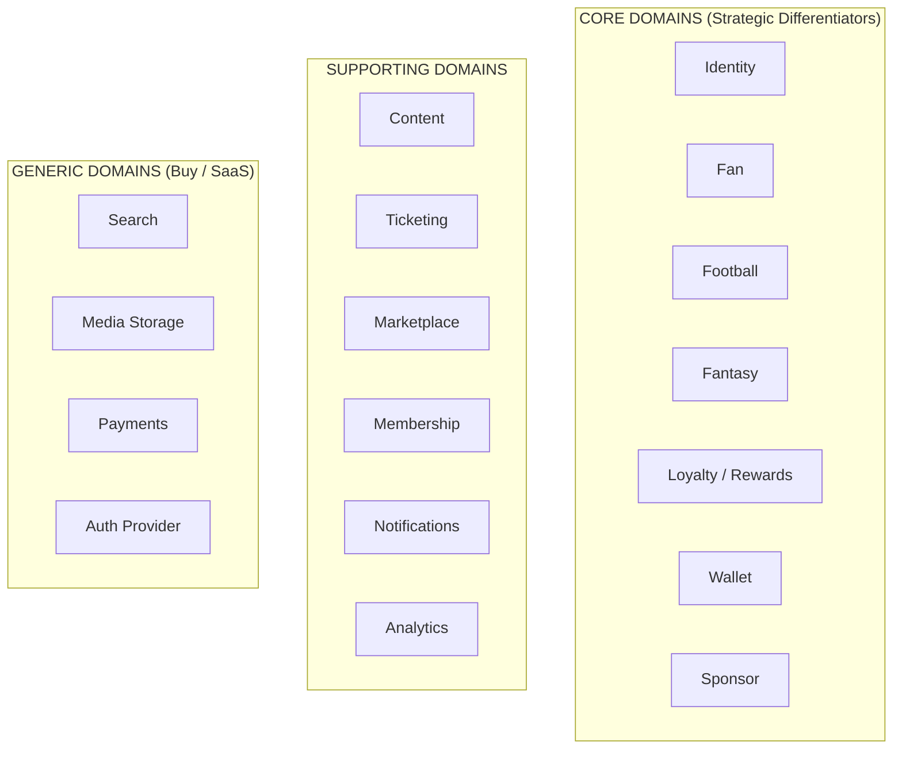
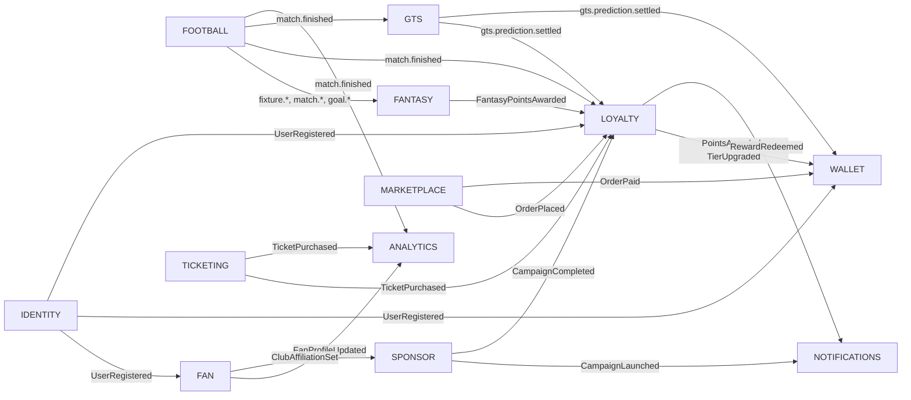

# PSL One — Domain Model

**Generated:** 2026-06-08  
**Author:** PSL One Chief Architecture Agent  
**Methodology:** Domain-Driven Design (Evans)

---

## Domain Classification

---

## Core Domains

### 1. Identity Domain

**Strategic Importance:** HIGHEST — the foundational layer the entire platform depends on.

**Purpose:** Manage the lifecycle of every principal (fans, club admins, sponsors, PSL staff) from registration to deletion.

#### Entities

| Entity | Description |
|---|---|
| `User` | Authenticated principal with credentials |
| `Identity` | Verified supporter identity (POPIA-compliant) |
| `Session` | Active authentication session |
| `Credential` | Password hash, MFA device, OAuth token |
| `ConsentRecord` | Timestamped POPIA consent per purpose |
| `VerificationToken` | Email / mobile verification token |

#### Aggregates

| Aggregate Root | Invariants |
|---|---|
| `User` | One identity per email/mobile. MFA enforced for admin roles. |
| `ConsentRecord` | Consent is immutable once granted — new record on change. |

#### Value Objects

| Value Object | Description |
|---|---|
| `EmailAddress` | Validated, normalised email |
| `MobileNumber` | E.164 format, South African validation |
| `UserRole` | `FAN`, `CLUB_ADMIN`, `SPONSOR`, `PSL_ADMIN`, `SUPER_ADMIN` |
| `AuthProvider` | `LOCAL`, `GOOGLE`, `FACEBOOK`, `APPLE` |

#### Domain Events

| Event | Trigger |
|---|---|
| `UserRegistered` | New registration completed |
| `UserVerified` | Email/mobile verified |
| `UserLoggedIn` | Successful authentication |
| `UserLoggedOut` | Session terminated |
| `MFAEnabled` | Multi-factor authentication activated |
| `PasswordReset` | Password successfully reset |
| `AccountSuspended` | Admin-triggered suspension |
| `ConsentGranted` | Supporter grants a consent purpose |
| `ConsentWithdrawn` | Supporter withdraws consent |

#### Business Rules

- Every fan must verify mobile number before accessing engagement features.
- POPIA consent must be captured at registration and persisted immutably.
- Admin accounts require MFA.
- Session tokens expire after 24h for mobile, 8h for web.
- Account deletion must trigger `UserDeleted` event and cascade POPIA erasure.

---

### 2. Fan Domain

**Purpose:** Manage the rich profile, preferences and club affiliations of every registered supporter.

#### Entities

| Entity | Description |
|---|---|
| `FanProfile` | Extended supporter profile beyond authentication |
| `ClubAffiliation` | Fan's association with one or more clubs |
| `PlayerFavourite` | Fan's favourite players |
| `EngagementHistory` | Summary of engagement activities |
| `Province` | Geographic classification |

#### Aggregates

| Aggregate Root | Invariants |
|---|---|
| `FanProfile` | One profile per User. Profile enrichment is additive. |

#### Value Objects

| Value Object | Description |
|---|---|
| `FanId` | UUID derived from UserId |
| `Province` | SA province enum |
| `FanTier` | `BRONZE`, `SILVER`, `GOLD`, `PLATINUM`, `SUPERFAN` |

#### Domain Events

| Event | Trigger |
|---|---|
| `FanProfileCreated` | After UserRegistered — profile initialised |
| `FanProfileUpdated` | Fan updates preferences |
| `ClubAffiliationSet` | Fan selects favourite club |
| `FanTierUpgraded` | Tier progression triggered by loyalty engine |

#### Business Rules

- Fan tier is computed by the Loyalty domain — Fan domain is a read consumer only.
- A fan may support multiple clubs but has one primary club.

---

### 3. Football Domain

**Purpose:** Be the authoritative source of truth for all football data — competitions, fixtures, results, standings, teams and players.

**Critical Design Constraint:** Must be multi-competition from day one. Never hardcode PSL.

#### Entities

| Entity | Description |
|---|---|
| `Competition` | PSL, MTN8, Nedbank Cup, CAF Champions League, AFCON |
| `Season` | A competition's active season (e.g. 2025/26) |
| `Club` | A participating football club |
| `Player` | A registered player |
| `Fixture` | A scheduled match |
| `Result` | The outcome of a completed fixture |
| `Standing` | League table entry for a club in a season |
| `Group` | Cup competition group stage |
| `MatchEvent` | Goal, yellow card, red card, substitution |

#### Aggregates

| Aggregate Root | Invariants |
|---|---|
| `Competition` | Must have an active Season at most. |
| `Fixture` | Cannot have a Result before kickoff. |
| `Standing` | Computed from Results — not stored independently. |

#### Value Objects

| Value Object | Description |
|---|---|
| `ActiveSeasonContext` | Used across all domains to scope queries to current season |
| `FixtureStatus` | `SCHEDULED`, `LIVE`, `FINISHED`, `POSTPONED`, `CANCELLED` |
| `Score` | Goals scored by home and away team |
| `Venue` | Stadium name and location |

#### Domain Events

| Event | Trigger |
|---|---|
| `fixture.created` | New fixture scheduled |
| `fixture.updated` | Fixture details changed |
| `match.started` | Kickoff confirmed |
| `match.finished` | Full-time confirmed with result |
| `goal.scored` | Goal event (drives Fantasy scoring) |
| `player.transferred` | Player moves club |

#### Business Rules

- `match.finished` is the trigger event for Fantasy scoring, Loyalty points, GTS settlement.
- Standings are recomputed after every `match.finished` event.
- Football domain never accepts write commands from other domains — it is an upstream system.

---

### 4. Fantasy Domain

**Purpose:** Manage fantasy football leagues, teams, transfers, scoring and leaderboards.

#### Entities

| Entity | Description |
|---|---|
| `FantasyLeague` | A competition-scoped fantasy league |
| `FantasyTeam` | A fan's squad of 15 players |
| `Gameweek` | A round of fixtures used for scoring |
| `Transfer` | Player swap within a team |
| `Chip` | Special power (Wildcard, Triple Captain, Bench Boost, Free Hit) |
| `FantasyScore` | Points accumulated by a team in a gameweek |
| `Leaderboard` | Ranked list of teams in a league |

#### Aggregates

| Aggregate Root | Invariants |
|---|---|
| `FantasyTeam` | 15 players: 2 GK, 5 DEF, 5 MID, 3 FWD. Max 3 from same club. 11 starters, 4 bench. |
| `FantasyLeague` | One active per Competition Season. |

#### Value Objects

| Value Object | Description |
|---|---|
| `Squad` | 15-player selection with formation |
| `ChipType` | `WILDCARD`, `TRIPLE_CAPTAIN`, `BENCH_BOOST`, `FREE_HIT` |
| `TransferCost` | Points deducted for excessive transfers |
| `CaptainMultiplier` | `1x`, `2x` (Captain), `3x` (Triple Captain chip) |

#### Domain Events

| Event | Trigger |
|---|---|
| `FantasyTeamCreated` | Fan creates initial squad |
| `FantasyTransferMade` | Player swapped in/out |
| `ChipActivated` | Power chip used |
| `FantasyPointsAwarded` | Gameweek scoring complete |
| `LeaderboardUpdated` | Standings recalculated |

#### Business Rules

- All squad composition rules enforced server-side only. Never trust client.
- Transfer deadline is match kickoff — server validates against `ActiveSeasonContext`.
- Chip is consumed on use — one use per gameweek enforced by aggregate invariant.
- Fantasy scores are derived from `goal.scored`, `match.finished` Football events.

---

### 5. Loyalty / Rewards Domain

**Purpose:** Manage points accumulation, reward catalogue, tier progression and redemption.

#### Entities

| Entity | Description |
|---|---|
| `LoyaltyAccount` | A fan's points balance and tier |
| `PointsTransaction` | Immutable ledger entry (earn or burn) |
| `Reward` | A redeemable reward item |
| `RedemptionOrder` | A fan's redemption of a reward |
| `Tier` | `BRONZE`, `SILVER`, `GOLD`, `PLATINUM`, `SUPERFAN` |
| `Campaign` | A sponsor-driven engagement earning opportunity |
| `CampaignParticipation` | Fan participation in a campaign |

#### Aggregates

| Aggregate Root | Invariants |
|---|---|
| `LoyaltyAccount` | Balance cannot go negative. Tier is computed, not set. |
| `PointsTransaction` | Immutable after creation. |
| `RedemptionOrder` | Points deducted atomically with redemption. |

#### Value Objects

| Value Object | Description |
|---|---|
| `Points` | Non-negative integer |
| `TierThreshold` | Points required for each tier level |
| `EarningRule` | Action → points mapping |

#### Domain Events

| Event | Trigger |
|---|---|
| `PointsAwarded` | Fan completes a qualifying action |
| `PointsDeducted` | Redemption or expiry |
| `TierUpgraded` | Fan crosses tier threshold |
| `TierDowngraded` | Annual reset |
| `RewardRedeemed` | Fan redeems a reward |
| `CampaignCompleted` | Fan completes sponsor campaign |

#### Business Rules

- Points are awarded for: registration, login streak, match attendance, GTS prediction, fantasy participation, content engagement, referrals, sponsor campaigns.
- Points expire annually if account is inactive.
- Redemption is atomic — points deducted and reward issued in same transaction.
- Sponsor campaigns must be approved by PSL before going live.

---

### 6. Wallet Domain

**Purpose:** Manage financial-grade wallet balances, transactions and ledger for Phase 1 (loyalty) through Phase 3 (financial wallet).

#### Entities

| Entity | Description |
|---|---|
| `Wallet` | A fan's digital wallet |
| `WalletTransaction` | Immutable ledger entry |
| `WalletBalance` | Current balance (computed from ledger) |
| `WalletTier` | Phase 1: Loyalty / Phase 3: Financial |

#### Aggregates

| Aggregate Root | Invariants |
|---|---|
| `Wallet` | Balance must never go negative. All mutations via events. |
| `WalletTransaction` | Immutable. Contains full audit trail. |

#### Value Objects

| Value Object | Description |
|---|---|
| `WalletId` | UUID linked to FanId |
| `Currency` | `POINTS` (Phase 1), `ZAR` (Phase 3) |
| `TransactionType` | `CREDIT`, `DEBIT`, `REDEMPTION`, `REFUND`, `EXPIRY` |
| `LedgerEntry` | Double-entry accounting record |

#### Domain Events

| Event | Trigger |
|---|---|
| `WalletCreated` | On FanProfileCreated |
| `WalletCredited` | Points/value added |
| `WalletDebited` | Points/value deducted |
| `WalletFrozen` | Fraud/compliance trigger |

#### Business Rules

- Every wallet operation creates an immutable ledger entry.
- Balance is always computed from ledger — never stored directly.
- Phase 3 financial wallet requires banking partner compliance.
- Wallet freezes require RBAC role `COMPLIANCE_OFFICER` or above.

---

### 7. Sponsor Domain

**Purpose:** Manage sponsor onboarding, campaign creation, audience segmentation, activation and reporting.

#### Entities

| Entity | Description |
|---|---|
| `Sponsor` | An approved commercial partner |
| `Campaign` | A time-limited engagement activation |
| `AudienceSegment` | A defined fan audience for targeting |
| `CampaignParticipation` | Fan engagement with a campaign |
| `SponsorReport` | Performance analytics delivered to sponsor |

#### Aggregates

| Aggregate Root | Invariants |
|---|---|
| `Campaign` | Must be approved before activation. Start before end date. |
| `AudienceSegment` | Permission-based only — no PII exported. |

#### Domain Events

| Event | Trigger |
|---|---|
| `CampaignCreated` | Sponsor creates campaign |
| `CampaignApproved` | PSL admin approves |
| `CampaignLaunched` | Goes live to audience |
| `CampaignCompleted` | End date reached or budget exhausted |
| `FanEngagedCampaign` | Fan interacts with campaign |

#### Business Rules

- No sponsor may access individual fan PII.
- All campaign targeting uses aggregated segments only.
- Betway has category exclusivity for sports betting campaigns.
- Campaigns must include PSL brand guidelines compliance.

---

## Supporting Domains

### Content Domain

**Purpose:** Manage news articles, match highlights, videos, interviews and editorial content.

**Key Entities:** `Article`, `Video`, `Author`, `Tag`, `Club` (reference), `Competition` (reference)

**Key Events:** `ArticlePublished`, `VideoUploaded`, `ContentEngaged`

**Note:** Content domain is a consumer of Football domain events. It does not own football data.

---

### Ticketing Domain

**Purpose:** Phase 1: aggregate external ticketing (Computicket, TicketPro). Phase 3: native ticketing engine.

**Key Entities:** `Event`, `Ticket`, `TicketOrder`, `Venue`, `SeatMap`

**Key Events:** `TicketPurchased`, `TicketTransferred`, `TicketValidated`, `TicketRefunded`

**Integration Risk:** External providers have their own data models. Anti-Corruption Layer required.

---

### Marketplace Domain

**Purpose:** E-commerce for football merchandise, memorabilia, experiences, travel packages.

**Key Entities:** `Product`, `Order`, `Vendor`, `Cart`, `Shipment`

**Key Events:** `OrderPlaced`, `OrderPaid`, `OrderShipped`, `OrderRefunded`

**Revenue Share:** 70% Club / 30% Platform for merchandise.

---

### Membership Domain

**Purpose:** Manage club membership subscriptions, benefits and access levels.

**Key Entities:** `Membership`, `MembershipTier`, `MembershipBenefit`, `MembershipSubscription`

**Revenue Share:** 80% Club / 20% Platform.

---

### Notifications Domain

**Purpose:** Multi-channel notification delivery (Push, Email, SMS, WhatsApp, In-App).

**Design:** Event-driven consumer only. Does not own business logic.

**Key Entities:** `NotificationTemplate`, `NotificationLog`, `NotificationPreference`

---

### Analytics Domain

**Purpose:** Aggregate engagement data for PSL, club and sponsor reporting. Powers AI recommendations.

**Design:** Read-only consumer of all domain events. Writes to Snowflake data warehouse.

---

## Generic Domains (Buy / SaaS)

| Domain | Recommended Approach |
|---|---|
| Search | AWS OpenSearch (managed) |
| Media Storage | AWS S3 + CloudFront |
| Payments | Peach Payments / Ozow (SA-compliant) |
| Auth Provider | AWS Cognito or Auth0 (decision needed) |
| Email | AWS SES |
| SMS | Clickatell or Infobip |
| WhatsApp | WhatsApp Business API via Meta |

---

## Domain Event Bus Topology

---

## Key Business Rules Summary

1. **Identity First** — No fan interaction is possible without a verified identity.
2. **POPIA by Design** — Consent is required for every data processing purpose.
3. **Event Sourcing for Financial** — Wallet and Loyalty accounts use immutable ledger pattern.
4. **Server-Side Enforcement** — All business rules (squad validation, transfer deadlines, point calculations) enforced server-side. Frontend is presentation only.
5. **Multi-Competition** — Football domain is competition-agnostic. Never hardcode PSL.
6. **No PII to Sponsors** — Sponsors receive aggregated audience intelligence only.
7. **Audit Everything** — Every state change in Loyalty, Wallet, Ticketing, Marketplace creates an immutable audit record.
