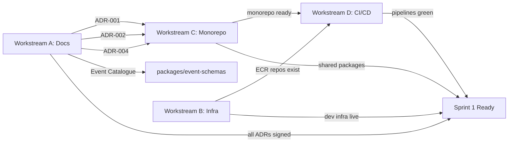

# PSL One — Sprint 0 Execution Plan

**Version:** 1.0  
**Date:** 2026-06-08  
**Authority:** PSL One Chief Architecture Agent  
**Status:** APPROVED FOR EXECUTION

---

## Sprint 0 Objective

Transform PSL One from a documentation-only repository into a **build-ready platform** where every AI agent and engineer has a clear mandate, a working environment, and unambiguous standards to build against.

Sprint 0 produces **no fan-facing features**. It produces the conditions under which features can be built correctly, quickly, and consistently by parallel AI agent streams.

Sprint 0 is complete when: any agent can receive a work package, understand exactly what to build, build it against known standards, and have it reviewed and merged with confidence.

---

## Sprint 0 Duration

**2 weeks: 2026-06-09 → 2026-06-22**

| Week | Focus |
|---|---|
| Week 1 | Documentation completion, decisions, monorepo bootstrap, Terraform foundation |
| Week 2 | Infrastructure provisioned, CI/CD green, agent packages scaffolded, ADRs signed off |

---

## Required Outputs

Sprint 0 is done when all of the following exist and are merged to `main`:

### Documentation Outputs

| # | Output | Location | Status |
|---|---|---|---|
| D1 | PRD Phase 1 (≥30 user stories) | `docs/product/PRD.md` | MUST WRITE |
| D2 | TDAP completed (all sections) | `docs/architecture/TDAP.md` | MUST COMPLETE |
| D3 | Implementation Programme (real delivery plan) | `docs/delivery/implementation-programme.md` | MUST REWRITE |
| D4 | ADR-001 through ADR-010 | `docs/adr/` | MUST WRITE |
| D5 | Kafka event catalogue | `docs/architecture/event-catalogue.md` | MUST WRITE |
| D6 | OpenAPI skeleton per service | `docs/api/` | MUST WRITE |
| D7 | Environment strategy | `docs/architecture/environment-strategy.md` | MUST WRITE |

### Infrastructure Outputs

| # | Output | Location | Status |
|---|---|---|---|
| I1 | Terraform: VPC + networking | `infra/terraform/modules/networking/` | MUST BUILD |
| I2 | Terraform: MSK Serverless | `infra/terraform/modules/kafka/` | MUST BUILD |
| I3 | Terraform: Aurora Serverless v2 | `infra/terraform/modules/database/` | MUST BUILD |
| I4 | Terraform: Redis ElastiCache | `infra/terraform/modules/cache/` | MUST BUILD |
| I5 | Terraform: ECS Fargate cluster | `infra/terraform/modules/ecs/` | MUST BUILD |
| I6 | Terraform: ECR repositories | `infra/terraform/modules/ecr/` | MUST BUILD |
| I7 | Terraform: S3 buckets | `infra/terraform/modules/storage/` | MUST BUILD |
| I8 | Terraform: CloudFront + API Gateway | `infra/terraform/modules/cdn/` | MUST BUILD |
| I9 | Terraform: WAF rules | `infra/terraform/modules/waf/` | MUST BUILD |
| I10 | Terraform: Secrets Manager | `infra/terraform/modules/secrets/` | MUST BUILD |
| I11 | Terraform: dev environment applied | AWS dev account | MUST APPLY |

### Codebase Outputs

| # | Output | Location | Status |
|---|---|---|---|
| C1 | Turborepo monorepo initialised | `/` | MUST BUILD |
| C2 | `packages/shared-types` scaffolded | `packages/shared-types/` | MUST BUILD |
| C3 | `packages/event-schemas` scaffolded | `packages/event-schemas/` | MUST BUILD |
| C4 | `packages/ui` scaffolded | `packages/ui/` | MUST BUILD |
| C5 | `packages/config` (ESLint, TS, Prettier) | `packages/config/` | MUST BUILD |
| C6 | `packages/kafka-client` scaffolded | `packages/kafka-client/` | MUST BUILD |
| C7 | `packages/auth-guards` scaffolded | `packages/auth-guards/` | MUST BUILD |
| C8 | `packages/testing` (test utilities) | `packages/testing/` | MUST BUILD |
| C9 | All service directories scaffolded (NestJS) | `services/*/` | MUST BUILD |
| C10 | All app directories scaffolded (Next.js) | `apps/*/` | MUST BUILD |

### CI/CD Outputs

| # | Output | Location | Status |
|---|---|---|---|
| CI1 | `ci.yml` — test, lint, build on PR | `.github/workflows/ci.yml` | MUST BUILD |
| CI2 | `deploy-dev.yml` — deploy on merge to main | `.github/workflows/deploy-dev.yml` | MUST BUILD |
| CI3 | `deploy-staging.yml` — manual trigger | `.github/workflows/deploy-staging.yml` | MUST BUILD |
| CI4 | `security-scan.yml` — Dependabot + SAST | `.github/workflows/security-scan.yml` | MUST BUILD |
| CI5 | Branch protection rules configured | GitHub settings | MUST CONFIGURE |
| CI6 | GitHub Issue Templates created | `.github/ISSUE_TEMPLATE/` | MUST CREATE |
| CI7 | GitHub CODEOWNERS defined | `.github/CODEOWNERS` | MUST CREATE |

---

## Workstreams

Sprint 0 runs **four parallel workstreams** from Day 1. Waiting is not acceptable.

### Workstream A: Documentation & Decisions (Days 1-5)

**Owner:** Programme Director Agent + Architecture team  
**Parallel with:** All other workstreams

| Day | Task | Output |
|---|---|---|
| 1 | Write ADR-001 (Auth) + ADR-002 (Monorepo) | `docs/adr/ADR-001.md`, `ADR-002.md` |
| 1 | Write ADR-003 (API) + ADR-004 (Kafka) | `docs/adr/ADR-003.md`, `ADR-004.md` |
| 2 | Write ADR-005 (DB) + ADR-006 (AWS Deploy) | `docs/adr/ADR-005.md`, `ADR-006.md` |
| 2 | Write ADR-007 (Football Data) + ADR-008 (Frontend) | `docs/adr/ADR-007.md`, `ADR-008.md` |
| 3 | Write ADR-009 (Testing) + ADR-010 (Security/POPIA) | `docs/adr/ADR-009.md`, `ADR-010.md` |
| 3 | Complete PRD Phase 1 (30 user stories) | `docs/product/PRD.md` |
| 4 | Complete TDAP (add missing sections) | `docs/architecture/TDAP.md` |
| 4 | Write Kafka event catalogue (all 40+ events) | `docs/architecture/event-catalogue.md` |
| 5 | Rewrite Implementation Programme (real sprints) | `docs/delivery/implementation-programme.md` |
| 5 | Write environment strategy + API skeleton | `docs/architecture/` |

---

### Workstream B: Infrastructure as Code (Days 1-10)

**Owner:** DevOps / Terraform Agent  
**Parallel with:** Workstream A, C, D

| Day | Task | Output |
|---|---|---|
| 1-2 | Terraform: VPC, subnets, security groups, Route53 | `infra/terraform/modules/networking/` |
| 2-3 | Terraform: MSK Serverless cluster + topics | `infra/terraform/modules/kafka/` |
| 3-4 | Terraform: Aurora Serverless v2 (per-service clusters) | `infra/terraform/modules/database/` |
| 4-5 | Terraform: ElastiCache Redis Serverless | `infra/terraform/modules/cache/` |
| 5-6 | Terraform: ECS Fargate cluster + task roles | `infra/terraform/modules/ecs/` |
| 6-7 | Terraform: ECR repos for all 14 services | `infra/terraform/modules/ecr/` |
| 7-8 | Terraform: S3 (media, event-archive, tf-state) | `infra/terraform/modules/storage/` |
| 8-9 | Terraform: CloudFront, API Gateway, WAF, ACM | `infra/terraform/modules/cdn/`, `waf/` |
| 9-10 | Terraform: Secrets Manager + KMS + GuardDuty | `infra/terraform/modules/secrets/` |
| 10 | `terraform apply` dev environment — validate | All resources live in dev AWS |

---

### Workstream C: Monorepo + Shared Packages (Days 1-7)

**Owner:** Platform Agent  
**Parallel with:** All workstreams

| Day | Task | Output |
|---|---|---|
| 1 | Bootstrap Turborepo monorepo (`pnpm` workspaces) | Root `package.json`, `turbo.json` |
| 1-2 | `packages/config` — ESLint, TypeScript, Prettier shared configs | `packages/config/` |
| 2-3 | `packages/shared-types` — all cross-service TypeScript types | `packages/shared-types/` |
| 3-4 | `packages/event-schemas` — all Kafka event interfaces + Zod schemas | `packages/event-schemas/` |
| 4-5 | `packages/kafka-client` — NestJS Kafka module wrapper | `packages/kafka-client/` |
| 5-6 | `packages/auth-guards` — RBAC guard, JWT decorator | `packages/auth-guards/` |
| 6 | `packages/testing` — test factories, mock Kafka, test DB setup | `packages/testing/` |
| 7 | `packages/ui` — ShadCN base + PSL design tokens | `packages/ui/` |

---

### Workstream D: CI/CD + Developer Experience (Days 3-10)

**Owner:** DevOps Agent  
**Parallel with:** Workstream B, C  
**Depends on:** C (monorepo bootstrapped)

| Day | Task | Output |
|---|---|---|
| 3-4 | `ci.yml` — lint + test + build on every PR | `.github/workflows/ci.yml` |
| 4-5 | `deploy-dev.yml` — ECS deploy on merge to main | `.github/workflows/deploy-dev.yml` |
| 5-6 | `deploy-staging.yml` — manual trigger | `.github/workflows/deploy-staging.yml` |
| 6 | `security-scan.yml` — Dependabot + GitHub SAST | `.github/workflows/security-scan.yml` |
| 7 | Branch protection: require CI, require review | GitHub settings |
| 7 | CODEOWNERS — per service directory ownership | `.github/CODEOWNERS` |
| 8 | GitHub Issue Templates (epic, feature, story, task, bug) | `.github/ISSUE_TEMPLATE/` |
| 9 | Local development `docker-compose.yml` | `docker-compose.yml` |
| 10 | Developer onboarding README | `README.md` |

---

## Dependencies

**Critical Path:** ADR-001 (auth) → packages/auth-guards → Identity Service (Sprint 1 Day 1)

---

## Definition of Done

Sprint 0 is complete when ALL of the following are true:

### Documentation DoD
- [ ] PRD Phase 1 contains ≥30 user stories with acceptance criteria
- [ ] TDAP is complete (no truncation, all sections present)
- [ ] Implementation Programme contains a real sprint-by-sprint delivery plan
- [ ] All 10 ADRs are written, reviewed and merged to `docs/adr/`
- [ ] Kafka event catalogue documents all events with JSON schema
- [ ] Environment strategy defines `dev`, `staging`, `production` accounts

### Infrastructure DoD
- [ ] `terraform plan` produces no errors for dev environment
- [ ] `terraform apply` succeeds — all resources live in AWS dev
- [ ] All 14 ECR repositories exist
- [ ] Aurora Serverless clusters accessible from ECS
- [ ] MSK Serverless Kafka cluster accessible from ECS
- [ ] Redis cluster accessible from ECS
- [ ] Secrets Manager has placeholder secrets for all services
- [ ] CloudFront distribution resolves to a working origin

### Codebase DoD
- [ ] `pnpm install` succeeds at monorepo root
- [ ] `turbo build` completes successfully (all packages)
- [ ] `turbo test` runs and passes (packages with tests)
- [ ] `turbo lint` passes with zero errors
- [ ] All `packages/` have TypeScript compilation passing
- [ ] All `services/` directories scaffolded (NestJS bootstrap)
- [ ] All `apps/` directories scaffolded (Next.js bootstrap)
- [ ] Shared event schemas compile and validate

### CI/CD DoD
- [ ] Opening a PR triggers `ci.yml` — lint, test, build
- [ ] Merging to `main` triggers `deploy-dev.yml`
- [ ] Branch protection prevents direct push to `main`
- [ ] PR requires 1 review + CI green before merge
- [ ] Security scan runs weekly
- [ ] `docker-compose.yml` starts local dev stack (Kafka, PostgreSQL, Redis)

---

## Acceptance Gates

Before Sprint 1 begins, the following gates must pass:

### Gate 1: Architecture Confidence
- All 10 ADRs signed off
- PRD Phase 1 approved by product owner
- TDAP completed and approved

### Gate 2: Infrastructure Live
- `terraform apply` successful in dev
- All services can connect to Kafka, PostgreSQL, Redis in dev

### Gate 3: Developer Experience
- New developer can set up local environment in < 30 minutes
- PR pipeline completes in < 5 minutes
- Deploy pipeline completes in < 10 minutes

### Gate 4: Agent Readiness
- Every specialist agent has a clear work package
- Agent input/output contracts are defined (see `docs/planning/agent-workstream-map.md`)
- Review agents are configured and can run against PRs

---

## What Must Be Completed Before Coding Begins

This is non-negotiable. Feature code (Identity Service, Football Service, etc.) must not start until:

1. **ADR-001 is signed off** — auth provider is decided. Identity Service uses the selected provider.
2. **ADR-002 is signed off** — monorepo tool is decided. All services live in it.
3. **ADR-004 is signed off** — Kafka schema format is decided. All events use it.
4. **ADR-005 is signed off** — ORM is decided. All services use the same ORM.
5. **PRD Phase 1 is written** — at least Identity + Football user stories exist.
6. **Monorepo is bootstrapped** — `packages/shared-types`, `packages/event-schemas` exist.
7. **`docker-compose.yml` works** — developers can run Kafka + PostgreSQL + Redis locally.
8. **CI pipeline is green** — no agent merges code that hasn't been tested.
9. **CODEOWNERS is set** — domain boundaries are enforced at the PR level.
10. **Kafka event catalogue is written** — event contracts exist before producers are built.

---

## What Can Be Parallelised in Sprint 0

| Parallel Track | Who | Duration |
|---|---|---|
| ADRs (1-10) | Programme Director + Arch Agent | Days 1-3 |
| Terraform modules | DevOps Agent | Days 1-10 |
| Monorepo + packages | Platform Agent | Days 1-7 |
| CI/CD pipelines | DevOps Agent | Days 3-10 |
| PRD writing | Product Owner + Programme Director | Days 1-5 |

No sequential bottleneck exists in Sprint 0 — all workstreams start on Day 1.
