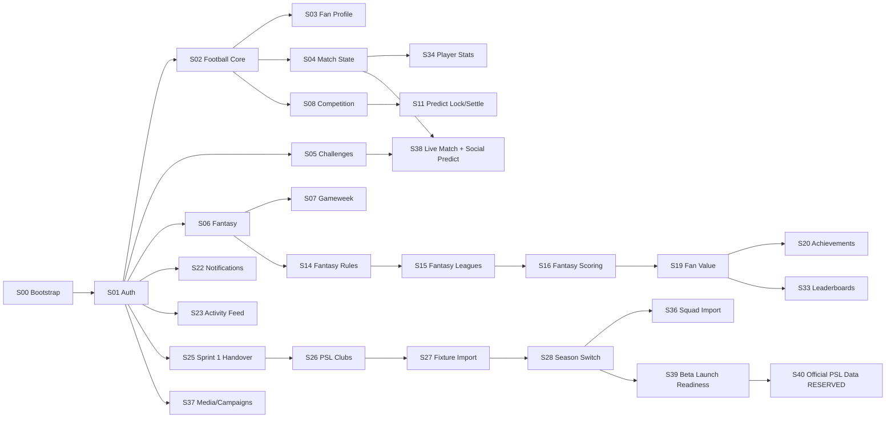
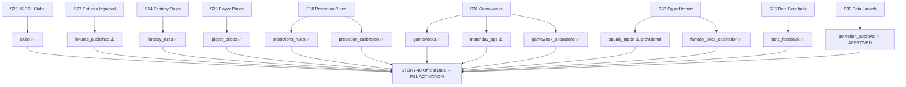

# PSL One — Story Index

**Purpose:** Authoritative index of every story from STORY-00 through STORY-39  
**Audience:** All contributors, programme management  
**Status:** Complete through STORY-39  
**Last verified:** 2026-06-14  
**Source of truth:** git log, docs/platform/STORY-BY-STORY-CODE-WALKTHROUGH.md, memory records  

---

## Quick Reference Table

| Story | Title | Sprint | Status | Commit |
|-------|-------|--------|--------|--------|
| STORY-00 | Platform Bootstrap & IAM | Sprint 0 | COMMITTED (docs only) | `04035d5` |
| STORY-01 | Fan Auth MVP | Sprint 1 | COMMITTED | `1d48fa8` |
| STORY-02 | Football Core MVP | Sprint 1 | COMMITTED | `1d48fa8` |
| STORY-03 | Fan Profile & Preferences MVP | Sprint 1 | COMMITTED | `1d48fa8` |
| STORY-04 | Live Fixture Feed / Match State MVP | Sprint 1 | COMMITTED | `1d48fa8` |
| STORY-05 | Social Predictions / Peer Challenges MVP | Sprint 1 | COMMITTED | `1d48fa8` |
| STORY-06 | Fantasy Team MVP | Sprint 1 | COMMITTED | `1d48fa8` |
| STORY-07 | Gameweek & Transfer Deadline MVP | Sprint 1 | COMMITTED | `1d48fa8` |
| STORY-08 | Competition & Season Management MVP | Sprint 1 | COMMITTED | `1d48fa8` |
| STORY-09 | Competition Import & Manual Seeding MVP | Sprint 1 | COMMITTED | `1d48fa8` |
| STORY-10 | Fixture & Gameweek Assignment MVP | Sprint 1 | COMMITTED | `1d48fa8` |
| STORY-11 | Prediction Engine: Lock & Settle MVP | Sprint 1 | COMMITTED | `1d48fa8` |
| STORY-12 | Fantasy Deadlines & Transfer Rules MVP | Sprint 1 | COMMITTED | `1d48fa8` |
| STORY-13 | Fantasy Chips MVP | Sprint 1 | COMMITTED | `1d48fa8` |
| STORY-14 | Fantasy Rules Admin Configuration MVP | Sprint 1 | COMMITTED | `1d48fa8` |
| STORY-15 | Fantasy Leagues & Cups MVP | Sprint 1 | COMMITTED | `1d48fa8` |
| STORY-16 | Gameweek-level Fantasy Scoring & History MVP | Sprint 1 | COMMITTED | `1d48fa8` |
| STORY-17 | Live Match Dashboard & Real-time Score Updates MVP | Sprint 1 | COMMITTED | `1d48fa8` |
| STORY-18 | Fantasy Auto-Substitution MVP | Sprint 1 | COMMITTED | `1d48fa8` |
| STORY-19 | Fan Value Ledger MVP | Sprint 1 | COMMITTED | `1d48fa8` |
| STORY-20 | Achievements & Badges MVP | Sprint 1 | COMMITTED | `1d48fa8` |
| STORY-21 | Rewards Readiness MVP | Sprint 1 | COMMITTED | `1d48fa8` |
| STORY-22 | Notifications & Alerts MVP | Sprint 1 | COMMITTED | `1d48fa8` |
| STORY-23 | Social Activity Feed MVP | Sprint 1 | COMMITTED | `1d48fa8` |
| STORY-24 | Admin Command Centre / Dashboard MVP | Sprint 1 | COMMITTED | `1d48fa8` + `5f4eebb` |
| STORY-25 | Sprint 1 Final Handover & Beta Readiness Review | Sprint 1 | COMMITTED | `26a4c03` |
| STORY-26 | PSL Club Experience & Season Readiness | Sprint 2 | COMMITTED | `94e577d` |
| STORY-27 | PSL Fixture Import, Validation & Publishing | Sprint 2 | COMMITTED | `1f826ea` |
| STORY-28 | Competition Switching: WC → PSL Season Mode | Sprint 2 | COMMITTED | `0e5fc51` |
| STORY-29 | PSL Fantasy Season Calibration | Sprint 2 | COMMITTED | `c207c35` |
| STORY-30 | Guess the Score PSL Season Calibration | Sprint 2 | COMMITTED | `88ffc09` |
| STORY-31 | PSL Gameweek & Matchday Operations Readiness | Sprint 2 | COMMITTED | `a3bedbd` |
| STORY-32 | Admin Operations Control Plane & Launch Readiness | Sprint 2 | COMMITTED | `f59bf21` |
| STORY-33 | PSL Leaderboards & Fan Value Season Scope | Sprint 2 | COMMITTED | `2f43344` |
| STORY-34 | PSL Player Stats & Match Performance | Sprint 2 | COMMITTED | `1b06a00` |
| STORY-35 | Beta Feedback, Bug Fixes & UX Polish | Sprint 2 | COMMITTED | `b5d7f6b` |
| STORY-36 | Squad Import, Price Finalisation & Activation Dry Run | Sprint 2 | COMMITTED | `6b04435` |
| STORY-37 | Media, Sponsor Campaigns & Wallet Foundation | Sprint 2 | COMMITTED | `b083014` |
| STORY-38 | Live Match Intelligence & Social Prediction Gaming | Sprint 2 | COMMITTED | `d0cc591` |
| STORY-39 | Beta Launch Readiness & Frontend Showcase | Sprint 2 | COMMITTED | `08e3852` |
| STORY-40 | Official PSL Data Finalisation | Sprint 3 | **RESERVED** | — |

---

## Story Dependency Diagram

### High-Level

### Season Activation Dependencies

---

## Story Details

### STORY-00 — Platform Bootstrap & IAM

- **Sprint:** Sprint 0
- **Status:** COMMITTED (planning/docs commit `04035d5`)
- **Purpose:** Establish monorepo structure, AWS account, IAM roles, initial ADRs
- **Evidence:** `docs/planning/sprint-0-bootstrap.md`, `docs/adr/`, initial commit
- **Notable:** No product code — infrastructure and architecture planning only
- **Limitation:** Deploy workflow and many planning docs reference microservices architecture (services/) that was superseded by NestJS monolith (apps/api)

### STORY-01 — Fan Auth MVP

- **Sprint:** Sprint 1
- **Status:** COMMITTED (`1d48fa8`)
- **Bounded context:** Auth & Identity (`apps/api/src/auth/`)
- **Key models:** `User` (email, password, role, dateOfBirth, consent fields)
- **Key capabilities:** Register, login, JWT issuance, password reset, `/auth/me`
- **Migration:** `20260609045934_init_auth_schema`, `20260609063037_add_fan_profile`
- **Frontend:** `/login`, `/register`, `/forgot-password`, `/reset-password`, `/account`
- **Notable:** JWT stored in localStorage (`psl_access_token`) — production session hardening is Sprint 3 backlog

### STORY-02 — Football Core MVP

- **Sprint:** Sprint 1
- **Status:** COMMITTED (`1d48fa8`)
- **Bounded context:** Football Core (`apps/api/src/football/`)
- **Key models:** `Competition`, `Season`, `SeasonTeam`, `Venue`, `Player`, `Club`, `Fixture`
- **Key capabilities:** Competition and season management, fixture CRUD, team/player registration
- **Migration:** `20260609054914_add_football_core`, `20260609070826_add_match_state`
- **Extended by:** STORY-04, STORY-08, STORY-26, STORY-27, STORY-34, STORY-38

### STORY-03 — Fan Profile & Preferences MVP

- **Sprint:** Sprint 1
- **Status:** COMMITTED (`1d48fa8`)
- **Bounded context:** Profile (`apps/api/src/profile/`)
- **Key models:** `FanProfile`, `NotificationPreference` (on User)
- **Frontend:** `/profile`, `/profile/edit`, `/profile/preferences`
- **Migration:** `20260609063037_add_fan_profile`

### STORY-04 — Live Fixture Feed / Match State MVP

- **Sprint:** Sprint 1
- **Status:** COMMITTED (`1d48fa8`)
- **Bounded context:** Football Core (extended)
- **Key capabilities:** Match state tracking (SCHEDULED/LIVE/FINISHED), score updates, fixture events
- **Migration:** `20260609070826_add_match_state`
- **Extended by:** STORY-17, STORY-34, STORY-38

### STORY-05 — Social Predictions / Peer Challenges MVP

- **Sprint:** Sprint 1
- **Status:** COMMITTED (`1d48fa8`)
- **Bounded context:** Predictions + Challenges (`apps/api/src/predictions/`, `apps/api/src/challenges/`)
- **Key models:** `Prediction`, `PeerChallenge`
- **Migration:** `20260609073452_add_predictions`
- **Extended by:** STORY-11, STORY-30, STORY-38 (Social Prediction separate bounded context)
- **Notable:** Original peer challenges bounded context is separate from STORY-38's SocialPredictionModule

### STORY-06 — Fantasy Team MVP

- **Sprint:** Sprint 1
- **Status:** COMMITTED (`1d48fa8`)
- **Bounded context:** Fantasy (`apps/api/src/fantasy/`)
- **Key models:** `FantasyTeam`, `FantasyTeamPlayer`, `FantasyPlayerPrice`
- **Migration:** `20260609120000_add_fantasy`
- **Extended by:** STORY-07, STORY-12, STORY-13, STORY-14, STORY-15, STORY-16, STORY-18, STORY-29, STORY-36

### STORY-07 — Gameweek & Transfer Deadline MVP

- **Sprint:** Sprint 1
- **Status:** COMMITTED (`1d48fa8`)
- **Bounded context:** Gameweeks (`apps/api/src/gameweeks/`)
- **Key models:** `Gameweek`, `FantasyTeamHistory`
- **Migration:** `20260609140000_add_gameweeks`

### STORY-08 — Competition & Season Management MVP

- **Sprint:** Sprint 1
- **Status:** COMMITTED (`1d48fa8`)
- **Bounded context:** Football Core (extended)
- **Key capabilities:** Competition format, stages, season lifecycle
- **Migration:** `20260609150000_add_competition_format_and_stages`, `20260609160000_add_competition_season_management`

### STORY-09 — Competition Import & Manual Seeding MVP

- **Sprint:** Sprint 1
- **Status:** COMMITTED (`1d48fa8`)
- **Migration:** `20260609170000_add_competition_import_jobs`
- **Key capabilities:** Bulk import jobs for clubs, players, fixtures

### STORY-10 — Fixture & Gameweek Assignment MVP

- **Sprint:** Sprint 1
- **Status:** COMMITTED (`1d48fa8`)
- **Migration:** `20260609180000_add_fixture_assignment_status`

### STORY-11 — Prediction Engine: Lock & Settle MVP

- **Sprint:** Sprint 1
- **Status:** COMMITTED (`1d48fa8`)
- **Key models:** `PredictionPointsLedger`, `PredictionStatus.VOID`
- **Migration:** `20260609190000_add_prediction_void_status`
- **Key capabilities:** Prediction lock, settle, void lifecycle; PredictionStatus.VOID added

### STORY-12 — Fantasy Deadlines & Transfer Rules MVP

- **Sprint:** Sprint 1
- **Status:** COMMITTED (`1d48fa8`)
- **Migration:** `20260610000000_add_fantasy_rules_engine`
- **Key capabilities:** `lockReason` field, `assertFantasyOpen` guard, transfer window enforcement

### STORY-13 — Fantasy Chips MVP

- **Sprint:** Sprint 1
- **Status:** COMMITTED (`1d48fa8`)
- **Key capabilities:** Fantasy chip tracking (wildcard, triple captain, bench boost, free hit)

### STORY-14 — Fantasy Rules Admin Configuration MVP

- **Sprint:** Sprint 1
- **Status:** COMMITTED (`1d48fa8`)
- **Migration:** `20260610000001_add_fantasy_rules_config`
- **Key models:** `FantasyRulesConfig`
- **Key capabilities:** All Fantasy service rules driven from DB config, not hardcoded

### STORY-15 — Fantasy Leagues & Cups MVP

- **Sprint:** Sprint 1
- **Status:** COMMITTED (`1d48fa8`)
- **Migration:** `20260610000002_fantasy_leagues_v2`
- **Key models:** `FantasyLeague`, `FantasyLeagueMembership`
- **Key capabilities:** Private/public/global leagues, leave, standings with transfer tie-breaker

### STORY-16 — Gameweek-level Fantasy Scoring & History MVP

- **Sprint:** Sprint 1
- **Status:** COMMITTED (`1d48fa8`)
- **Migration:** `20260610000004_fantasy_gameweek_scoring`
- **Key models:** `FantasyGameweekScore`, `FanValueLedger`
- **Notable:** Seed fix for MatchStats FK dependency

### STORY-17 — Live Match Dashboard & Real-time Score Updates MVP

- **Sprint:** Sprint 1
- **Status:** COMMITTED (`1d48fa8`)
- **Migration:** `20260610000005_live_match_dashboard`
- **Key capabilities:** `LiveMatchService` with 16 methods, provider-neutral adapter, live fantasy preview read-only

### STORY-18 — Fantasy Auto-Substitution MVP

- **Sprint:** Sprint 1
- **Status:** COMMITTED (`1d48fa8`)
- **Migration:** `20260610000006_fantasy_auto_substitution`
- **Key models:** `FantasyAutoSubstitution`

### STORY-19 — Fan Value Ledger MVP

- **Sprint:** Sprint 1
- **Status:** COMMITTED (`1d48fa8`)
- **Migration:** `20260610000007_fan_value_ledger_v2`
- **Key models:** `FanValueLedger`
- **Key capabilities:** Non-financial loyalty score, immutable ledger entries

### STORY-20 — Achievements & Badges MVP

- **Sprint:** Sprint 1
- **Status:** COMMITTED (`1d48fa8`)
- **Migration:** `20260610000008_achievements_badges`
- **Key models:** `AchievementDefinition`, `UserAchievement`, `BadgeDefinition`, `UserBadge`, `AchievementProgress`
- **Key capabilities:** 17 definitions/badges seeded, integration hooks in service layer

### STORY-21 — Rewards Readiness MVP

- **Sprint:** Sprint 1
- **Status:** COMMITTED (part of Sprint 1 consolidation, plus `de2f3fe`)
- **Migration:** `20260611000001_rewards_readiness`
- **Key models:** `RewardReadinessDefinition`, `FanRewardReadiness`
- **Key capabilities:** 6 seeded reward definitions, eligibility engine

### STORY-22 — Notifications & Alerts MVP

- **Sprint:** Sprint 1
- **Status:** COMMITTED (part of Sprint 1 consolidation, plus `049e44e`)
- **Migration:** `20260611000002_notifications`
- **Key models:** `Notification`, `NotificationPreference`, `NotificationTemplate`
- **Key capabilities:** In-app notification delivery, fan preference management, event hooks in 5 services

### STORY-23 — Social Activity Feed MVP

- **Sprint:** Sprint 1
- **Status:** COMMITTED (`19a6620`)
- **Migration:** `20260611000003_activity_feed`
- **Key models:** `ActivityFeedItem`, `ActivityFeedLike`
- **Key capabilities:** 22-method service, 5 integration hooks, fan social feed

### STORY-24 — Admin Command Centre / Dashboard MVP

- **Sprint:** Sprint 1
- **Status:** COMMITTED (`5f4eebb`)
- **Bounded context:** Admin Dashboard (`apps/api/src/admin-dashboard/`)
- **Key capabilities:** 27 API routes, aggregation-only queries, 13 web pages

### STORY-25 — Sprint 1 Final Handover & Beta Readiness Review

- **Sprint:** Sprint 1
- **Status:** COMMITTED (`26a4c03`)
- **Purpose:** Documentation, beta readiness assessment, Sprint 2/3 planning
- **Evidence:** `docs/platform/`, `SPRINT-1-FINAL-HANDOVER.md`

### STORY-26 — PSL Club Experience & Season Readiness

- **Sprint:** Sprint 2
- **Commit:** `94e577d`
- **Status:** COMMITTED
- **Migration:** `20260611000004_club_experience`
- **Key capabilities:** 16 PSL clubs seeded, 6 tables, 11 fan + 8 admin pages
- **Notable:** `AuthModule` required in `ClubExperienceModule`

### STORY-27 — PSL Fixture Import, Validation & Publishing

- **Sprint:** Sprint 2
- **Commit:** `1f826ea`
- **Status:** COMMITTED
- **Migration:** `20260611000005_fixture_import`
- **Key models:** `FixtureImportBatch`, `FixtureImportRow`
- **Key capabilities:** `isPublished` on Fixture, 21 routes, 10 web pages

### STORY-28 — Competition Switching: WC → PSL Season Mode

- **Sprint:** Sprint 2
- **Commit:** `0e5fc51`
- **Status:** COMMITTED
- **Migration:** `20260611000006_season_switch_audit`
- **Key models:** `SeasonSwitchAudit`
- **Key capabilities:** 7-check readiness (expanded to 13 by STORY-36), transactional activation logic, rollback

### STORY-29 — PSL Fantasy Season Calibration

- **Sprint:** Sprint 2
- **Commit:** `c207c35`
- **Status:** COMMITTED
- **Key capabilities:** 96 provisional players, `FantasyCalibrationModule`, 13 routes, 7 web pages
- **Notable:** `Player.externalId` non-unique — use `findFirst` pattern

### STORY-30 — Guess the Score PSL Season Calibration

- **Sprint:** Sprint 2
- **Commit:** `88ffc09`
- **Status:** COMMITTED
- **Migration:** `20260612000001_prediction_rules_config`
- **Key models:** `PredictionRulesConfig`
- **Key capabilities:** 11 admin routes, 9 web pages, 8th season-switching check, published-only fixture eligibility

### STORY-31 — PSL Gameweek & Matchday Operations Readiness

- **Sprint:** Sprint 2
- **Commit:** `a3bedbd`
- **Status:** COMMITTED
- **Key capabilities:** `GameweekOperationsModule`, 15 admin routes, 12 web pages, 9th season-switching check

### STORY-32 — Admin Operations Control Plane & Launch Integration Readiness

- **Sprint:** Sprint 2
- **Commit:** `f59bf21`
- **Status:** COMMITTED
- **Migration:** `20260612000002_integration_provider_config`
- **Key models:** `IntegrationProviderConfig`
- **Key capabilities:** 9 provider configs seeded, 17 API routes, 12 web pages, capability gap review

### STORY-33 — PSL Leaderboards & Fan Value Season Scope

- **Sprint:** Sprint 2
- **Commit:** `2f43344`
- **Status:** COMMITTED
- **Key capabilities:** `EngagementModule`, 10 admin routes, 6 fan leaderboard pages, 10 admin pages, 10th season-switching check

### STORY-34 — PSL Player Stats & Match Performance

- **Sprint:** Sprint 2
- **Commit:** `1b06a00`
- **Status:** COMMITTED
- **Migration:** `20260612000004_player_match_stats`
- **Key models:** `PlayerMatchStats` (2 enums)
- **Key capabilities:** `PlayerStatsModule`, 17 API routes, 10 fan + 11 admin pages, 11th season-switching check

### STORY-35 — Beta Feedback, Bug Fixes & UX Polish

- **Sprint:** Sprint 2
- **Commit:** `b5d7f6b`
- **Status:** COMMITTED
- **Migration:** `20260612000005_admin_audit_log_and_beta_indexes`
- **Key models:** `AdminAuditLog`
- **Key capabilities:** `getBetaToken()` centralisation, performance indexes, `BetaFeedbackModule`, 4 admin pages

### STORY-36 — Squad Import, Price Finalisation & Activation Dry Run

- **Sprint:** Sprint 2
- **Commit:** `6b04435`
- **Status:** COMMITTED
- **Migration:** `20260612000006_squad_import_price_calibration`
- **Key capabilities:** `SquadImportModule`, `FantasyPriceCalibrationModule`, 13 season-switching checks (full gate), activation dry-run (read-only), 17 web pages

### STORY-37 — Media, Sponsor Campaigns & Wallet Foundation

- **Sprint:** Sprint 2
- **Commit:** `b083014`
- **Status:** COMMITTED
- **Migration:** `20260612000007_media_campaign_wallet_foundation`
- **Key models:** 22 enums, 13 tables
- **Key capabilities:** `MediaModule`, `SponsorsModule`, `CampaignsModule`, `CampaignRewardsModule`, `WalletIntegrationModule` (sandbox), `CampaignAnalyticsModule`, `SiliconEnterpriseSandboxWalletAdapter` (zero outbound calls), 25 web pages

### STORY-38 — Live Match Intelligence & Social Prediction Gaming

- **Sprint:** Sprint 2
- **Commit:** `d0cc591`
- **Status:** COMMITTED
- **Migrations:** `20260613000001_social_prediction_match_centre`, `20260613000002_direct_challenges_campaign_triggers`, `20260609063038_drop_old_notification_prefs` (compatibility)
- **Key models:** 11 new enums, 13 new tables
- **Key capabilities:**
  - `SocialPredictionModule` — FIFO marketplace, direct challenges (atomic `$transaction`), immutable points ledger, compliance: `INTERNAL_REVIEW_REQUIRED`
  - `MatchCentreModule` — standings, form, player ratings, sandbox ingestion, provider-neutral `DataSourceType`
  - `CampaignTriggerService` — 9 trigger types, idempotent, failure-isolated
  - 10 fan match pages, 11 admin live-match pages
- **Notable:** Direct challenge acceptance uses conditional `updateMany` in `$transaction` — fully atomic; `direct-accept:{listingId}:{fanUserId}` idempotency key

### STORY-39 — Beta Launch Readiness & Frontend Showcase

- **Sprint:** Sprint 2
- **Commit:** `08e3852`
- **Status:** COMMITTED
- **Migration:** `20260614000001_beta_launch_readiness`
- **Key models:** `BetaCohort`, `BetaCohortMember`, `SeasonActivationApproval` + 3 enums
- **Key capabilities:**
  - `BetaLaunchModule` — 27 routes, 13-check gate (delegates to `SeasonSwitchingService`, no duplication)
  - Activation dry-run (`dryRunOnly: true`) and rollback dry-run (`rollbackWillNotBePerformed: true`) — both read-only
  - `createApproval()` — status `APPROVED`, never `ACTIVATED`; `activationPerformedAt` is null
  - `BetaLaunchSmokeTestService` — 24-item registry; `activationRouteAbsent: true` confirmed programmatically
  - 17 admin pages, 1 fan `/beta` landing page
  - 5 new platform docs (runbook, rollback runbook, hypercare plan, frontend walkthrough, smoke test plan)
- **Safety:** PSL season NOT activated. World Cup untouched.

### STORY-40 — Official PSL Data Finalisation

- **Sprint:** Sprint 3
- **Status:** **RESERVED — not implemented**
- **Purpose:** Replace provisional squad data (96 placeholders) with official PSL 2026/27 registration data; confirm official fixture schedule; promote Fantasy and Prediction rules to ACTIVE; clear remaining season-switching blockers
- **Dependency:** Requires official PSL data to be received

---

## Stories with Incomplete Evidence

| Story | Issue | Evidence Found |
|-------|-------|----------------|
| STORY-00 | No product code; planning docs only | `docs/planning/sprint-0-bootstrap.md`, `04035d5` commit |
| STORY-09 through STORY-13 | Merged into single Sprint 1 commit `1d48fa8`; individual commit hashes not available | `docs/platform/STORY-BY-STORY-CODE-WALKTHROUGH.md` sections, migration timestamps |
| STORY-25 | Documentation story — committed in `26a4c03` | `SPRINT-1-FINAL-HANDOVER.md`, platform docs |
